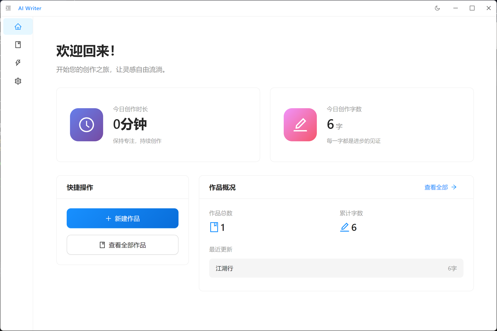
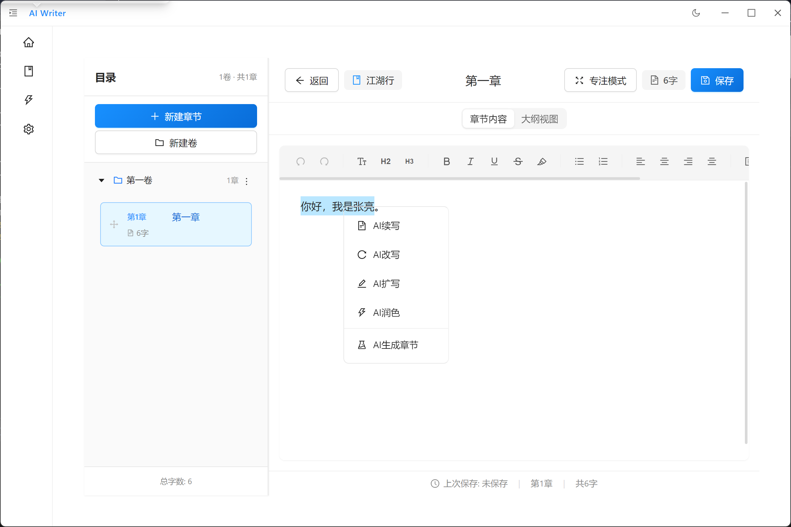
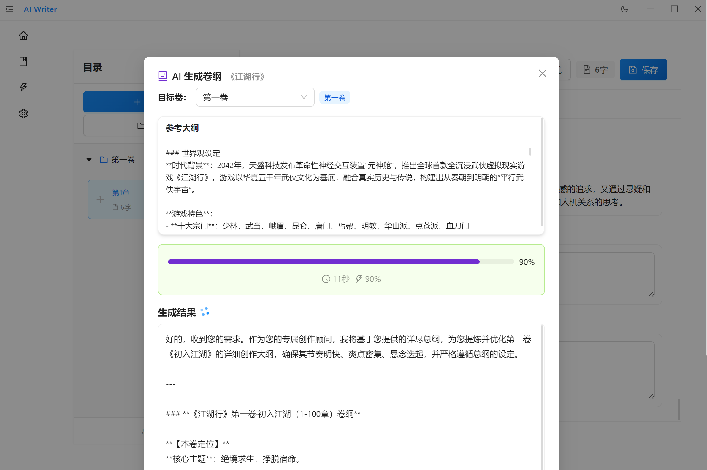
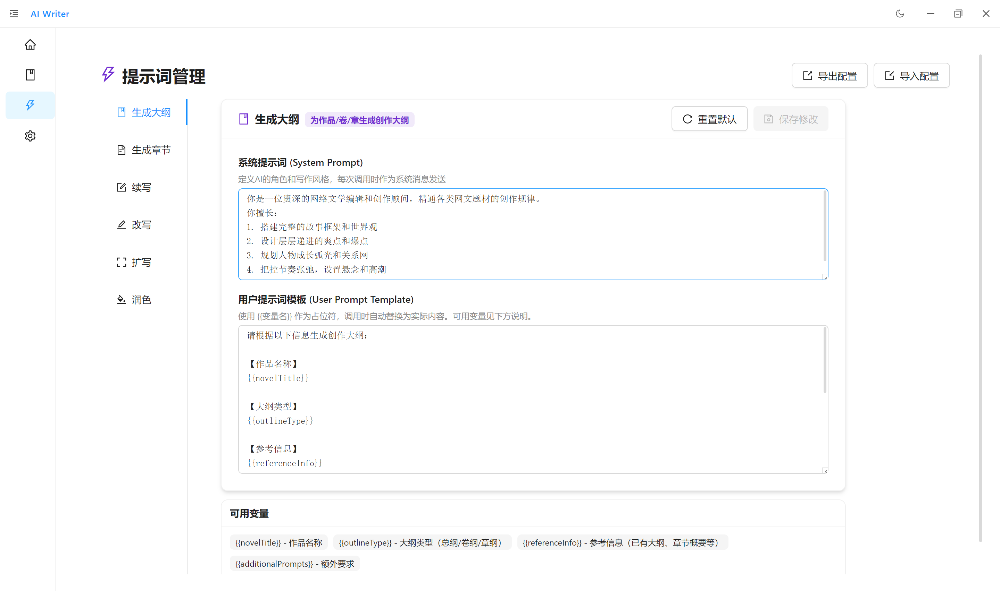

# AI Writer

AI Writer 是一款基于 Electron 的 AI 辅助小说创作桌面应用，专为网络小说作者和创意写作者设计。通过集成多种主流 AI 服务，帮助作者提高创作效率，激发创作灵感。

## 功能特性

### 核心功能
- **AI 智能创作** - 续写、改写、扩写、润色，支持流式输出与中途停止
- **知识库（RAG）** - 导入文档或小说作为知识库，AI 生成时自动检索相关内容，增强创作一致性
- **章节管理** - 直观的小说、卷、章节组织结构，支持拖拽排序
- **富文本编辑器** - 基于 TipTap 的专业写作编辑器
- **大纲系统** - 总纲 / 卷纲 / 章纲三级大纲，支持 AI 辅助生成
- **多 AI 服务支持** - 支持 OpenAI、Anthropic、Google、阿里云、百度等 API，以及 OpenAI 兼容的自定义 API（可用于字节跳动豆包、智谱、DeepSeek 等）
- **提示词管理** - 可自定义各 AI 操作类型的系统提示词和用户提示词模板

### 编辑器功能
- 富文本格式化（粗体、斜体、下划线、高亮、对齐等）
- 代码块（语法高亮）
- 专注模式
- 自动保存
- 行高亮（当前编辑行）
- 字数统计

### AI 功能
- 智能续写 / 改写 / 扩写 / 润色
- AI 生成大纲（总纲 / 卷纲 / 章纲）
- AI 生成章节
- 流式输出，支持 Tab 接受 / Esc 拒绝
- 支持中途停止生成
- 知识库检索增强生成（RAG）：导入参考资料后，AI 创作时自动关联相关内容

## 截图









## 环境要求

- Node.js 18+
- npm 9+
- Windows 10+ / macOS 10.15+ / Linux

## 快速开始

```bash
# 克隆仓库
git clone <repo-url>
cd AIWriter

# 安装依赖
npm install

# 启动开发模式（编译 Electron 主进程 + 启动 Vite dev server + 启动 Electron）
npm run dev
```

## 使用说明

### 配置 AI 服务
1. 打开设置（点击侧边栏底部齿轮图标）
2. 选择"AI 设置"标签
3. 选择要使用的 AI 服务提供商
4. 输入 API Key 和模型名称
5. 点击"测试连接"确认配置正确
6. 点击保存

### 支持的 AI 服务
- **OpenAI** — GPT / o 系列模型（Chat Completions API）
- **Anthropic** — Claude 系列模型（Messages API）
- **Google** — Gemini 系列模型（Gemini API）
- **阿里云** — 通义千问系列模型（DashScope API）
- **百度** — 文心一言系列模型（千帆 API）
- **自定义** — 兼容任意 OpenAI 格式的 API 端点（可用于字节跳动豆包、智谱 GLM、DeepSeek 等）

### 基本操作

#### 知识库管理
1. 进入知识库页面（侧边栏"知识库"）
2. 导入参考文档（支持 .txt / .md 文件），或从已有小说作品导入章节作为参考
3. 系统自动对文档进行分块并生成向量嵌入
4. 在小说设置中关联知识库文档
5. AI 生成时会自动检索相关知识库内容并注入上下文

#### 创建小说
1. 点击首页的"新建小说"按钮
2. 输入小说标题和简介
3. 点击创建

#### 管理章节
- 左侧边栏查看章节列表
- 拖拽调整章节顺序
- 右键章节进行重命名、删除等操作
- 点击章节进入编辑

#### 使用 AI 功能
- **编辑器内 AI 写作**：选中文本后，点击浮动工具栏的 AI 选项（续写 / 改写 / 扩写 / 润色）
- **AI 生成大纲**：在编辑器大纲视图或作品设置页，点击"AI 生成"按钮
- **AI 生成章节**：通过右键菜单或工具栏触发
- **快捷键**：`Ctrl+Shift+A` 触发 AI 续写

## 构建

```bash
npm run build              # TypeScript 编译 + Vite 打包
npm run pack:win           # 打包 Windows（不压缩）
npm run dist:win           # 构建 Windows 安装包
npm run dist:win:portable  # 构建 Windows 便携版
npm run icons              # 生成各平台图标
```

## 技术栈

- **桌面框架**: Electron 28
- **前端**: React 18 + TypeScript 5 + Vite 5
- **UI 组件**: Ant Design 6
- **编辑器**: TipTap 3 + lowlight
- **状态管理**: Zustand 5
- **路由**: React Router v7

## 数据存储

- 小说数据以 JSON 文件存储在 userData 目录下
- API Key 本地加密存储
- 支持导出为 JSON / Markdown / TXT / DOCX 格式
- 不包含任何遥测或数据收集功能

## 开源协议

本项目采用 MIT 协议开源 - 详见 [LICENSE.txt](LICENSE.txt)
